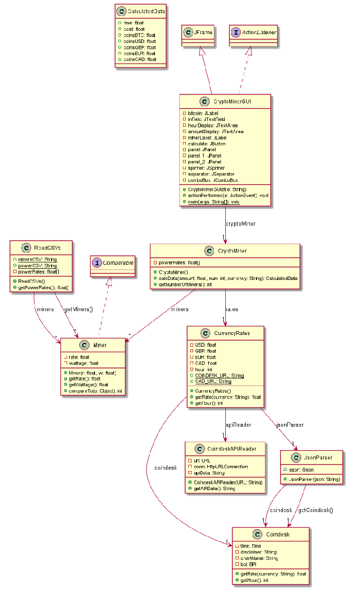
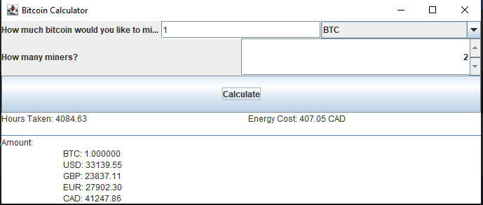

# S21Hackathon
Summer 2021 Hackathon Project

Group Members: David Cooksley, Evan Cooksley

# 1. Summary
This is a GUI-based application that calculates and displays information about a bitcoin mining setup. It: 

	- Pulls from coindesk API to find current BTC values
	- Imports data on mining setup and energy costs from .csv files
	- Allows for user input of desired amount of BTC in BTC, USD, GBP, EUR, or CAD
	- Allows for user input of desired number of miners.
	- Uses miners sorted by efficiency of power/coin.
	- Calculates necessary time to mine desired amount of BTC.
	- Calculates energy costs in CAD to mine desired BTC, accounting for variable power costs by time of day.
	- Displays calculated time and cost
	- Displays value of mined BTC in BTC, USD, GBP, EUR, and CAD
	
# 2. UML Diagram

# 3. Execution Screenshot

	
